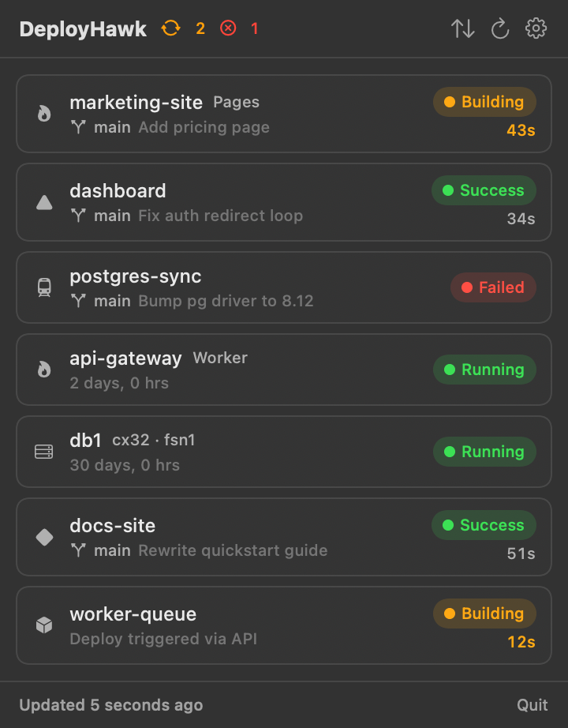

<p align="center">
  
</p>

<h1 align="center">DeployHawk 🚀</h1>

<p align="center">
  <b>A native macOS menu bar app that watches all your deployments at once.</b><br>
  Cloudflare, Vercel, Railway, Hetzner, Netlify, Render — one list, live status, native notifications.
</p>

<p align="center">
  <a href="https://buymeacoffee.com/jcsuen"></a>
  
  
  
</p>

<p align="center">
  
</p>

---

Shipping to Cloudflare Pages, a couple of Workers, a Vercel site, a Railway service and three Hetzner boxes? DeployHawk keeps a hawk in your menu bar so you stop refreshing six dashboards to check "did it build? did it fail? is the server up?"

## Features

- **🌐 Six providers, one list** — Cloudflare (Workers + Pages), Vercel, Railway, Hetzner Cloud, Netlify, Render. Every project, service and server with real brand logos, live status, and per-provider filter chips.
- **🔔 Native notifications** — the moment a build succeeds or fails, with branch and build time. Instant Worker uploads (which never show a "building" state) are detected too. Per-project mute when something gets noisy.
- **⚡ A menu bar that talks** — pulsing orange badge while builds run, red count on failures, a green tick after instant deploys. Adaptive polling: 5-second refresh while anything is building, relaxed when idle.
- **🛠 Act, don't just watch** — retry failed deployments, roll back to a previous deployment or Worker version, restart Railway services, power Hetzner servers on/off, trigger Netlify builds — from the menu bar, with confirmation on the destructive ones.
- **🔍 Deployment drill-down** — commit details, build command, per-deployment preview URLs, and **inline build logs** for Cloudflare Pages. No dashboard tab needed.
- **📈 Server vitals** — Hetzner servers get a metrics grid: CPU, network in/out, disk read/write sparklines for the last hour, plus IPs, specs, OS and datacenter.
- **🔑 Zero-paste setup** — detects provider CLIs you're already logged into (wrangler, vercel, netlify, railway, hcloud) and connects with one click. Wrangler's rotating OAuth session is re-read automatically. Pasted tokens live in the macOS Keychain, never in plaintext.
- **🖥 Native and lightweight** — SwiftUI, zero dependencies, no Electron, no telemetry. Built-in update check against GitHub releases.

## Install

```bash
curl -fsSL https://raw.githubusercontent.com/jcsuen/deployhawk/main/install.sh | bash
```

Or build from source:

```bash
git clone https://github.com/jcsuen/deployhawk.git
cd deployhawk
./scripts/make-app-bundle.sh   # builds and installs /Applications/DeployHawk.app
open /Applications/DeployHawk.app
```

## Connect a provider

Click the 🚀 in the menu bar → gear icon. Anything you're logged into via CLI shows up under **Found on this Mac** — one click connects it. Otherwise paste an API token:

| Provider | Where to get a token | Monitoring | Actions |
|---|---|---|---|
| Cloudflare | dash.cloudflare.com → My Profile → API Tokens (or just be logged into `wrangler`) | Pages deployments + build logs, Workers versions | Retry, rollback (Pages + Worker versions) |
| Vercel | vercel.com/account/tokens | Deployments across personal + teams | Redeploy, instant rollback (promote) |
| Railway | railway.app/account/tokens (Account token) | Latest deployment per project | Redeploy, restart |
| Hetzner Cloud | console.hetzner.cloud → project → Security → API Tokens | Server status (running/stopped) | Power on/off, reboot |
| Netlify | app.netlify.com/user/applications | Published deploys + history | Trigger build, publish (rollback) |
| Render | dashboard.render.com → Account Settings → API Keys | Service deploys | Deploy latest, rollback |

## Security

- Tokens are stored in the **macOS Keychain**, never in files or UserDefaults.
- CLI-imported credentials are read from the CLI's own config on your machine and sent only to that provider's API.
- No telemetry, no analytics, no third-party servers. The app talks to provider APIs and nothing else.

## Development

```bash
swift build && swift run        # dev run (notifications fall back to osascript)
./scripts/make-app-bundle.sh    # release .app → /Applications
```

Handy env vars: `DEPLOYHAWK_DEMO=1` runs a scripted deploy lifecycle with fake projects (great for seeing the notifications and menu bar animations without deploying anything); `DEPLOYHAWK_FAKE_UPDATE=1` forces the update banner.

See `CLAUDE.md` for architecture notes. Adding a provider is one file conforming to `ProviderClient` plus a `ProviderKind` case.

## License

[PolyForm Noncommercial 1.0.0](LICENSE) — free for personal and noncommercial use.
